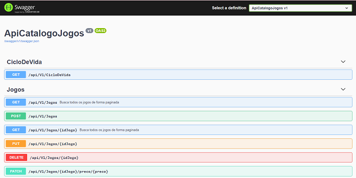

# Bootcamp GFT START #2 .NET

## O projeto proposto no Bootcamp foi o desenvolvimento de CRUD no formato de API, para um Catalago de Jogos.

### Requisitos

* Windows 7 ou superior
* .NET versão 5.0.103

### Instruções

1. Fazer Downloading do projeto
   <a href="https://github.com/ffsf-filho/dio-apicatalogojogos/archive/main.zip">Download ZIP</a>

   OU

   ```git clone  https://github.com/ffsf-filho/dio-apicatalogojogos.git```
2. Descompactar o projeto
3. Acessar o prompt de comando, para ir até a paste do projeto
4. Executar o comando de build do dotnet

   ```
   dotnet build
   ```
5. Executar o programa

   ```
   dotnet run
   ```

### Tela da API
